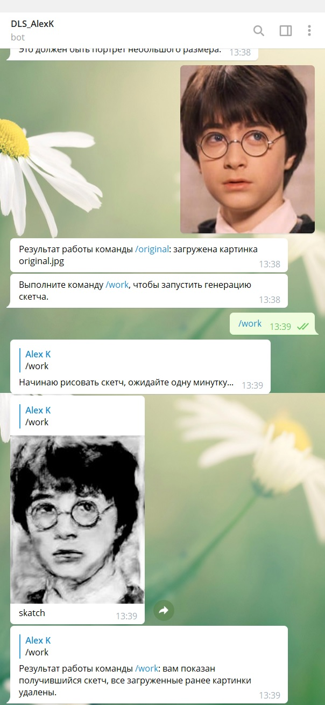

# dls-s1-project
dls s1 project

Итоговый проект.

**0.** Тема: Генерация изображений (pix2pix).

**1.** 1_tiny_pix2pix_on_pytorch_AlexK.ipynb - ноутбук для шага 1: реализована принципиальная схема архитектуры;

**1.1.** 2_tiny_pix2pix_on_pytorch_AlexK.ipynb - ноутбук для шага 1.1: архитектура применена для генерации цветных картинок из чернобелых для датасета cifar10;

**2.** Выбор датасета: dataset_jpg - директория с датасетом Face-Sketch, файлы сконвертированы в формат jpg;  
https://github.com/chaofengc/Face-Sketch - из этого проетка взял датасет Face-Sketch и сконвертировал в jpg.

**3.** 3_tiny_pix2pix_on_pytorch_Alexk.ipynb - ноутбук для шага 3: архитектура применена для осмысленной (моей) задачи - генарации скетчей из фотографии (обучение происходит на портретах);  
https://github.com/taey16/pix2pixBEGAN.pytorch - из этого проекта взята основа для класса даталоадера.

**4.** Интерфейс к модели: телеграм-бот, которого можно запустить на Колабе (или на любом сервере с Linux).  
Бот сделан на основе моего проекта - бота для NST https://github.com/alexk-git/dls-bot 

pix2pix_generator_sketches_e1000.pt - предобученная модель, сгенерироавна в результате работы 3-го ноутбука (1000 эпох, 7 часов на Кагле), будет использоваться ботом для генерации скетчей

telegram_bot_pix2pix.ipynb - ноутбук для запуска телеграм-бота на колабе, в нём удаляется старую версию Python 3.6, установливается Python 3.7, pip 3.7, правильная версия pytorch и запускается бот. К ноутбуку нужно подключить гугл-драйв, в котором есть папка gdrive/MyDrive/pix2pix/ с файлами pytorch_models/pix2pix_generator_sketches_e1000.pt (веса), pix2pix.py (инференс) и DLS_AlexK_bot_pix2pix.py (бот).

pytorch_models/pix2pix_generator_sketches_e1000.pt - сохранённые веса от предобученной модели

DLS_AlexK_bot_pix2pix.py - скрипт с кодом самого бота, который запускается в ноутбуке telegram_bot_pix2pix.ipynb

pix2pix.py - скрипт используется ботом, в нём создаётся модель, загружаются веса, делается инференс на фотографию и сохраняется результат, который бот демонстрирует в ответ

В директории img/test находятся портреты, которые можно использовать для тестирования бота.

bot_at_work.jpg - скриншот телеграмма с примером работы бота.

Для запуска бота на сервере Linux в его коде нужно изменить путь к файлу модели, а в скрипте модели изменить путь к файлу с весами.

